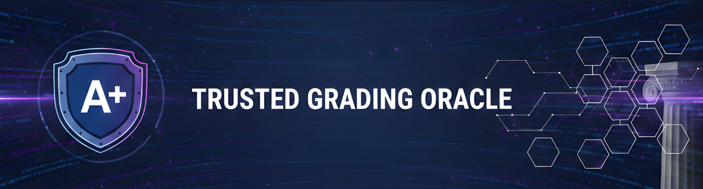
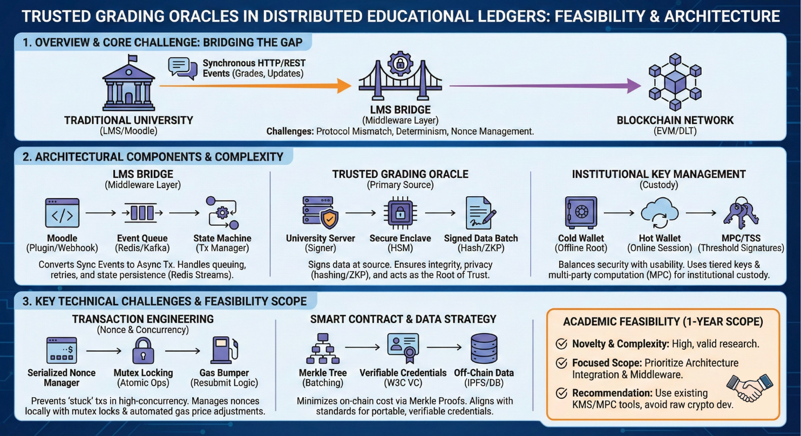
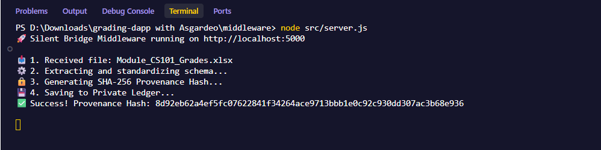

# 🎓 Trusted Grading Oracle: Silent Bridge Middleware



**Research Focus:** Seamless LMS-to-Blockchain Integration  
**Author:** Nithika Perera  
**Institution:** SLIIT (BSc Hons in Information Technology - Software Engineering)  
**Security Partner:** Integrated with **WSO2 Asgardeo**  

---

## 📺 Demo Preview

*Figure 1: [Updated Version] High-speed extraction and cryptographic sealing of academic records.*

---

## 📌 Project Overview
Traditional academic record-keeping systems are centralized and vulnerable to manipulation. This project introduces the **Silent Bridge**, a middleware solution designed to bridge the gap between legacy Learning Management Systems (LMS) and Decentralized Ledgers.

The goal is to provide a "Zero-Knowledge" experience for lecturers—allowing them to secure academic records on a tamper-proof ledger without needing to interact directly with complex blockchain wallets or gas fees.

### 🔐 Secure Identity Management with Asgardeo
We have integrated **Asgardeo by WSO2** to provide enterprise-grade authentication. This ensures:
*   **Verified Access:** Only authorized university personnel can access the ingestion portal.
*   **OIDC Standard:** Uses OpenID Connect for secure, standardized identity propagation.
*   **Role-Based Security:** Protects the cryptographic signing process from unauthorized triggers.

---

## 🏗 System Architecture: The "Silent Bridge"
The Silent Bridge acts as the intelligence layer between the User Interface and the Private Ledger.

1.  **Ingestion:** Accepts standard `.xlsx` and `.csv` grading reports.
2.  **Extraction:** Standardizes disparate data schemas into a clean, unified JSON structure.
3.  **Hashing:** Generates a unique **SHA-256 Provenance Hash** for each batch, creating a mathematical "seal".
4.  **Immutability:** Records the hash and data within a Private Ledger for permanent verification.



---

## ✅ Core Features
*   **Enterprise Auth:** Full integration with **Asgardeo CIAM**.
*   **Schema Standardization:** Automatic parsing of diverse grading sheet formats.
*   **Cryptographic Provenance:** Every record batch is hashed to ensure data integrity.
*   **Private Ledger Storage:** A simulated high-performance ledger for rapid record retrieval.
*   **Visual Receipts:** Real-time feedback with provenance hashes for every successful "seal" operation.

---

## 🛠 Tech Stack

| Component | Technology |
| :--- | :--- |
| **IAM** | **WSO2 Asgardeo** (OpenID Connect) |
| **Frontend** | React + Vite (Vanilla CSS for Premium UI) |
| **Middleware** | Node.js + Express (The "Silent Bridge") |
| **Data Logic** | Multer (File Handling) + XLSX (Parsing) |
| **Security** | Crypto (SHA-256 Hashing) |
| **Storage** | Private Ledger (JSON-based Immutable Simulation) |

---

## 🔗 Quick Reference

| Component | URL | Purpose |
| :--- | :--- | :--- |
| **Frontend UI** | `http://localhost:5173` | Lecturer Portal |
| **Middleware API** | `http://localhost:5000` | Silent Bridge Entry |
| **Private Ledger** | `./private_ledger/database.json` | Local Data Storage |

---

## 📁 System Structure

```text
grading-dapp-with-asgardeo/
├── frontend/             # React + Vite UI
├── middleware/           # Node.js Logic (Silent Bridge)
└── private_ledger/       # JSON-based Immutable Log
```

---

## 🚀 How to Run Locally

### 1. Prerequisites
*   [Node.js](https://nodejs.org/) (v16+)
*   An [Asgardeo](https://asgardeo.io/) Application configured (OIDC).

### 2. Setup Middleware
```bash
cd middleware
npm install
node src/server.js   
```
*The middleware will run on `http://localhost:5000`.*

### 3. Setup Frontend
```bash
cd frontend
npm install
npm run dev
```
*The UI will be available at `http://localhost:5173`.*

### 4. Usage
1.  Log in using your **Asgardeo** credentials.
2.  Drag and drop a `.csv` or `.xlsx` grading sheet.
3.  Click **"Verify & Seal Record"**.
4.  View the generated **Provenance Hash** and check the `private_ledger/database.json`.

---

## 📸 In Action: Middleware Logs
When you seal a record, the Silent Bridge middleware logs the extraction and hashing process in real-time.


*Figure 2: Real-time terminal output showing the 4-stage data ingestion process.*


---

## 🔮 Future Roadmap
*   **Phase 3:** Integration with Public Blockchains (Ethereum/Sepolia) for cross-institution verification.
*   **Phase 4:** Zero-Knowledge Proofs (ZKP) for privacy-preserving grade verification.
*   **Phase 5:** Direct API connectors for Moodle and Canvas LMS.
